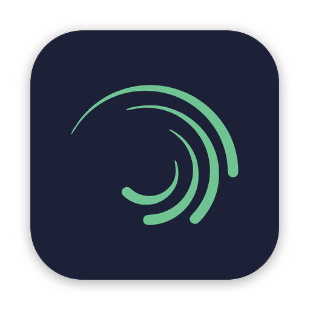

<h1 align="center">
  
  <br/>
  Alight Motion PC (AM-PC)
</h1>

<p align="center">
  <strong>Studio Motion Graphics, Visual Effects (VFX), dan Animasi Tingkat Lanjut untuk PC & Desktop.</strong>
</p>

<p align="center">
  
  
  
  
</p>

---

## 🌟 Tentang Alight Motion PC

**Alight Motion PC (AM-PC)** adalah editor motion graphics dan visual effects pro berbasis desktop yang menghadirkan alur kerja otentik **Alight Motion** ke lingkungan PC (Windows & Web).

Dirancang khusus dengan ergonomi desktop: kontrol mouse presisi tinggi, keyboard shortcuts instan, timeline multi-layer lapang, akselerasi GPU perangkat keras, dan integrasi penuh dengan Windows Start Menu, Taskbar, serta macOS-style Dock (MyDockFinder).

---

## ✨ Fitur Unggulan

### ⚡ Desktop Native Experience
- **Standalone Portable App**: Dapat langsung dijalankan tanpa instalasi yang rumit (`Alight Motion PC.exe`).
- **Dock & Launchpad Ready**: Dilengkapi icon squircle berpresisi standar macOS/Windows dengan padding transparan dan drop shadow halus.
- **Ultra Low Latency**: Akselerasi hardware WebGL/Canvas dengan konsumsi memori optimal.

### 📈 Keyframe & Graph Curve Editor
- Interpolasi keyframe fleksibel untuk semua properti layer (Posisi, Skala, Rotasi, Opasitas, Warna, dll.).
- **Graph Curve Editor Interaktif**: Kontrol kurva Bezier visual penuh (Ease-In, Ease-Out, Ease-InOut, Bounce, dan Custom Tension Curves) persis seperti versi mobile.

### 🧱 Multi-Layer Compositing
- Dukungan berbagai tipe layer: **Vector Shapes**, **Teks Kustom**, **Media (Gambar & Video)**, dan **Audio Track**.
- Layer parenting & hierarki transformasi.
- Blend modes lengkap (Normal, Multiply, Screen, Overlay, Darken, Lighten, Color Dodge, dll.).

### 🧭 3D Transform & Spatial Camera
- Rotasi spasial sumbu X, Y, Z.
- Pengaturan kedalaman layer (Depth/Z-Axis) dan orientasi kamera 3D.

### 🎨 Modular Visual Effects (VFX) Engine
- **Color & Light**: Brightness/Contrast, Hue/Saturation, Exposure/Gamma, Hot Color, RGB Split.
- **Blur**: Gaussian Blur, Directional Blur, Box Blur, Motion Blur.
- **Distortion & Warp**: Oscillate, Pinch/Bulge, Swirl, Wave Warp, Mirror, Tile.
- **Procedural & Matte**: Linear/Radial Mask, Chroma Key, Vignette, Glow.

### 📦 Ekosistem Preset & AMHUB
- Arsitektur ramah preset: siap untuk import dan export preset animasi serta integrasi ekosistem komunitas AMHUB.

---

## 🖥️ Keyboard Shortcuts

| Shortcut | Aksi |
| :--- | :--- |
| `Space` | Play / Pause Timeline |
| `J` / `K` / `L` | Mundur 1 frame / Pause / Maju 1 frame |
| `Home` / `End` | Pergi ke Awal / Akhir Proyek |
| `Ctrl + Z` | Undo tindakan terakhir |
| `Ctrl + Y` / `Ctrl + Shift + Z` | Redo tindakan |
| `Ctrl + C` / `Ctrl + V` | Copy / Paste Layer |
| `Delete` / `Backspace` | Hapus Layer terpilih |
| `Ctrl + S` | Simpan Proyek |

---

## 🚀 Cara Menjalankan

### 1. Menggunakan File Standalone Portable (Windows)
Aplikasi portable dapat langsung dijalankan tanpa perlu menginstall dependensi:
- Klik ganda `Buka-Alight-Motion-PC.bat` di root project, atau
- Buka langsung: `release/Alight-Motion-PC-win-x64/Alight Motion PC.exe`

### 2. Menjalankan Mode Development (Electron)
Pastikan telah menginstal [Node.js](https://nodejs.org/):
```bash
# Pasang dependensi
npm install

# Jalankan desktop app
npm start
```

### 3. Menjalankan di Browser (Web / PWA)
Anda dapat membuka file `index.html` langsung di browser berbasis Chromium (Google Chrome, Microsoft Edge, Brave) atau menjalankan server lokal:
```bash
npm run web
```
Lalu buka alamat `http://localhost:3000` di browser Anda.

### 4. Build Ulang File Portable Executable (.exe)
Untuk membuat paket mandiri Windows executable dengan icon resmi yang sudah terkalibrasi:
```bash
npm run build:portable
```
Hasil build akan berada di folder `release/Alight-Motion-PC-win-x64/`.

---

## 🛠️ Arsitektur Teknologi

- **Desktop Shell**: [Electron](https://www.electronjs.org/) (Chromium + Node.js)
- **Rendering Pipeline**: HTML5 Canvas 2D + WebGL Hardware Acceleration
- **Styling & UI**: Modern Responsive CSS3 (`css/desktop.css`, `css/theme.css`)
- **Asset Pipeline**: Multi-resolution calibrated icons (16px s/d 512px & Windows `.ico`)
- **Target OS**: Windows 10/11 (x64) & Modern Desktop Browsers

---

## 📁 Struktur Direktori

```plaintext
AM-PC/
├── css/                   # Stylesheet desktop dan tema antarmuka
│   ├── desktop.css        # Layout, panel, kontrol header & timeline
│   └── theme.css          # Palet warna gelap Alight Motion & aksen neon
├── electron/              # Shell runtime Electron desktop
│   ├── main.js            # Lifecycle window, menu, dan IPC desktop
│   └── preload.js         # Bridge API keamanan Electron
├── icons/                 # Aset ikon resolusi tinggi & dock icons
├── scripts/               # Script otomasi build (portable builder)
├── index.html             # Antarmuka utama editor Alight Motion
├── manifest.webmanifest   # Konfigurasi PWA desktop
├── package.json           # Dependensi dan script build
└── Buka-Alight-Motion-PC.bat # Launcher cepat Windows
```

---

## 📄 Lisensi

Proyek ini dirilis di bawah lisensi [MIT License](LICENSE).

---

<p align="center">
  Dibuat dengan ❤️ untuk komunitas kreator motion graphics & video editor di PC.
</p>
